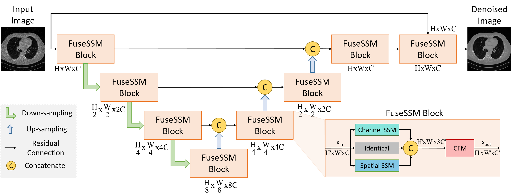

<hr>
<h1 align="center">
  DenoMamba <br>
  <sub>A fused state-space model for low-dose CT denoising</sub>
</h1>

<div align="center">
  <a href="https://avesis.hacibayram.edu.tr/saban.ozturk" target="_blank">Şaban&nbsp;Öztürk</a>;
  <a href="https://www.linkedin.com/in/oguz-can-duran/" target="_blank">Oğuz&nbspCan Duran</a>;
  <a href="https://kilyos.ee.bilkent.edu.tr/~cukur/" target="_blank">Tolga&nbsp;Çukur</a>;
</div>  
<hr>

<h3 align="center">[<a href="https://arxiv.org/abs/denomamba">arXiv</a>]</h3>

Official PyTorch implementation of **DenoMamba**, a novel denoising method based on state-space modeling (SSM), that efficiently captures short- and long-range context in medical images. Following an hourglass architecture with encoder-decoder stages, DenoMamba employs a spatial SSM module to encode spatial context and a novel channel SSM module equipped with a secondary gated convolution network to encode latent features of channel context at each stage. Feature maps from the two modules are then consolidated with low-level input features via a convolution fusion module (CFM).





## Dependencies

```
python>=3.8.13
cuda=>11.6
torch>=2.2
torchvision>=0.17
pillow
scipy
mamba-ssm==1.1.3
```
You are welcome to ask any library issues.

## Dataset
To reproduce the results reported in the paper, we recommend the following dataset processing steps:

Sequentially select subjects from the dataset.
Apply skull-stripping to 3D volumes.
Select 2D cross-sections from each subject.
Normalize the selected 2D cross-sections before training and before metric calculation.

You should structure your aligned dataset in the following way:

```
/datasets/LDCT/
  ├── Full_Dose                 ├── Quarter_Dose
  │   ├── 1mm                   │   ├── 1mm
  │     ├── Sharp Kernel        │     ├── Sharp Kernel
  │       ├── L506              │       ├── L506
  |          - ...              |          - ...
  │       ├── ...               │       ├── ...
  │     ├── Soft Kernel         │     ├── Soft Kernel
  │       ├── L506              │       ├── L506
  |          - ...              |          - ...
  │       ├── ...               │       ├── ...
  │   ├── 3mm                   │   ├── 3mm
  │     ├── Sharp Kernel        │     ├── Sharp Kernel
  │       ├── L192              │       ├── L192
  |          - ...              |          - ...
  │       ├── ...               │       ├── ...
  │     ├── Soft Kernel         │     ├── Soft Kernel
  │       ├── L192              │       ├── L192
  |          - ...              |          - ...
  │       ├── ...               │       ├── ... 

``` 
## Training

### Example Command for training with default arguments
```
python3 train.py --full_dose_path example_full_dose_path --quarter_dose_path example_quarter_dose_path --path_to_save example_path_to_save_the_trained_model
```
### Argument Descriptions

| Argument            | Description                                                   |
|---------------------|---------------------------------------------------------------|
| --full_dose_path        | Path to full dose images                                  |
| --quarter_dose_path     | Path to quarter dose images                               |
| --dataset_ratio         | The ratio of dataset to use (in case of big dataset)      |
| --train_ratio           | Ratio of train dataset to all dataset                     |
| --batch_size            | Batch size.                                               |
| --in_ch                 | Number of input image channels                            |
| --out_ch                | Number of output image channels                           |
| --learning_rate         | Learning rate                                             |
| --max_epoch             | Maximum number of epochs                                  |
| --continue_to_train     | Continue any interrupted training                         |
| --path_to_save          | Path to save the trained model                            |
| --ckpt_path             | Path to trained and saved checkpoint model                |
| --validation_freq       | Frequency to run validation                               |
| --save_freq             | Frequency to save model                                   |
| --batch_number          | Number of a batch in validation to show the sample images |
| --num_blocks            | Number of transformer block layers                        |
| --dim                   | Number of transformer blocks                              |
| --num_refinement_blocks | Number of refinement blocks                               |


#### Key Required Arguments
```
--full_dose_path: Must specify the path to the full-dose dataset.
--quarter_dose_path: Must provide the path to the quarter-dose dataset.
--path_to_save: Required to specify where the trained model will be saved.
```
These arguments are essential for the program to locate the necessary datasets and save the trained model.


## Test

### Example Command for test with default arguments
```
python test.py --full_dose_path example_full_dose_path --quarter_dose_path example_quarter_dose_path --path_to_save example_path_to_save_the_trained_model --output_root example_path_to_save_the_output_images
```
### Argument Descriptions

| Argument            | Description                                                   |
|---------------------|---------------------------------------------------------------|
| --full_dose_path        | Path to full dose images                                  |
| --quarter_dose_path     | Path to quarter dose images                               |
| --dataset_ratio         | The ratio of dataset to use (in case of big dataset)      |
| --train_ratio           | Ratio of train dataset to all dataset                     |
| --batch_size            | Batch size.                                               |
| --in_ch                 | Number of input image channels                            |
| --out_ch                | Number of output image channels                           |
| --ckpt_path             | Path to trained and saved checkpoint model                |
| --output_root           | Path to save denoised images                |
| --num_blocks            | Number of transformer block layers                        |
| --dim                   | Number of transformer blocks                              |
| --num_refinement_blocks | Number of refinement blocks                               |


#### Key Required Arguments
```
--full_dose_path: Must specify the path to the full-dose dataset.
--quarter_dose_path: Must provide the path to the quarter-dose dataset.
--ckpt_path: Required to specify where the trained model was saved.
--output_root : Required to specify where to save the output images.
```
These arguments are essential for the program to locate the necessary datasets and save the trained model.


For any questions, comments and contributions, please feel free to contact Şaban Öztürk (saban.ozturk[at]bilkent.edu.tr)

## Acknowledgments

This code uses libraries from [Restormer](https://github.com/swz30/Restormer) and [mamba](https://github.com/state-spaces/mamba) repository.

<hr>

Copyright © 2024, ICON Lab.
